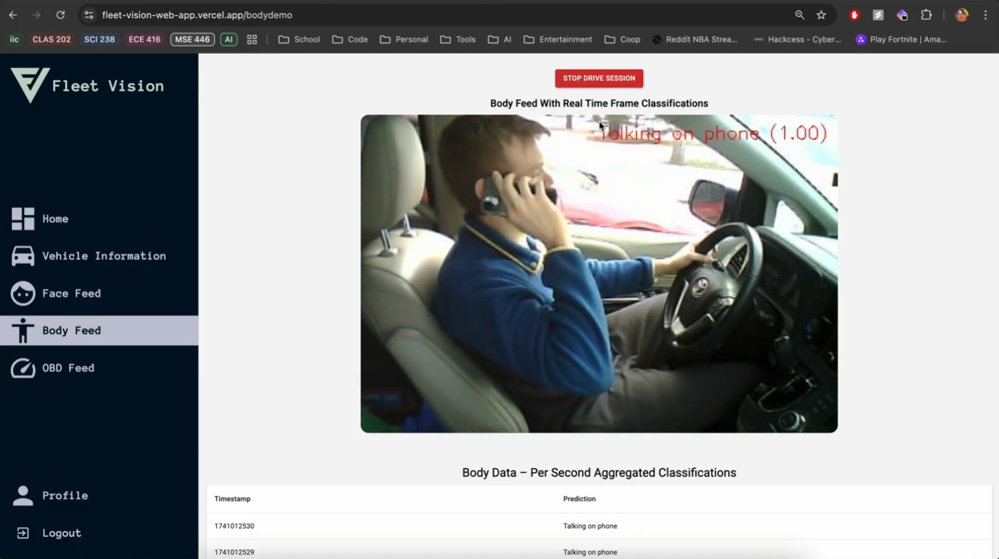
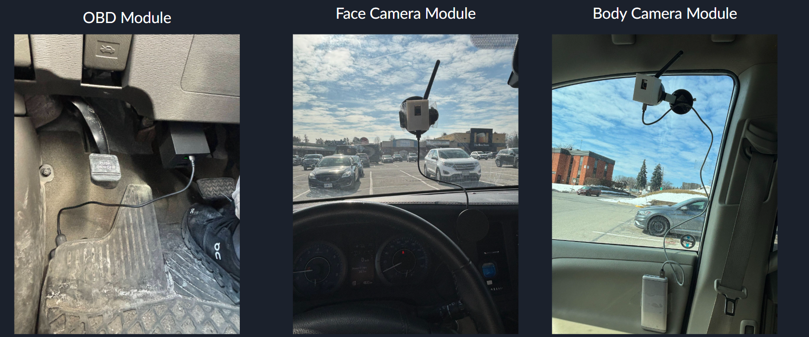

# Fleet Vision


## Overview

Fleet Vision is a comprehensive vehicle monitoring and driver safety system designed to enhance fleet management and driver safety through real-time monitoring and analytics. The system combines computer vision, OBD-II vehicle data, and cloud-based analytics to provide a complete picture of driver behavior and vehicle performance.

## Video Demonstration

[](https://drive.google.com/file/d/1jhZySFJ_BmHR1zjNEgbxbeXLgKqwypyG/view?usp=sharing)

_Click the image above to watch the full demo video_

## Table of Contents

- [Features](#features)
- [System Architecture](#system-architecture)
- [Hardware Components](#hardware-components)
- [Software Components](#software-components)
- [Installation and Setup](#installation-and-setup)
- [Usage](#usage)

## Features

### Real-time Driver Monitoring

- **Facial Analysis**: Detects driver drowsiness by monitoring eye closure and yawning
- **Body Posture Analysis**: Monitors driver posture and behavior for distracted driving
- **OBD-II Data Collection**: Captures real-time vehicle data including speed, RPM, and more

### Analytics Dashboard

- **Safety Score**: Comprehensive driver safety scoring based on multiple factors
- **Trip History**: Detailed logs of all driving sessions with timestamps
- **Performance Metrics**: Vehicle performance data visualization
- **Incident Detection**: Automatic detection and logging of safety incidents

### System Integration

- **Cloud Storage**: All data securely stored in Firebase
- **Real-time Processing**: Edge computing on ESP32 devices with server-side processing
- **Web Interface**: Modern, responsive dashboard for fleet managers

## System Architecture

![System Architecture Diagram]

_[TODO: Add system architecture diagram showing the flow of data from hardware devices through the server to the web application]_

The Fleet Vision system consists of three main components:

1. **Hardware Devices**: ESP32 cameras and OBD-II interface connected to the vehicle
2. **Real-time Server**: Python Flask server that processes data streams from the hardware
3. **Web Application**: Next.js dashboard for visualizing and analyzing the data

Data flows from the vehicle through the hardware devices to the real-time server, which processes the data and stores it in Firebase. The web application retrieves the data from Firebase and presents it to the user. The web application also recieves the classified data from the real-time server via Server Sent Events and displays it on its live feed pages.

## Hardware Components

### ESP32 Camera Modules

- **Face Camera**: ESP32-CAM AI-Thinker module with OV2640 camera for monitoring the driver's face
- **Body Camera**: ESP32-CAM AI-Thinker module with OV2640 camera for monitoring the driver's body posture

### OBD-II Interface

- **ESP32 Microcontroller**: Connected to the vehicle's OBD-II port
- **Longan Labs OBD-II Dev Kit**: Used to interface between the ESP32 and the vehicle's OBD-II port for real-time vehicle data collection



_The image above shows the ESP32 cameras and OBD-II interface installed in a vehicle_

## Software Components

### Real-time Server

- **Flask Backend**: Handles data streams from the hardware devices
- **Computer Vision Models**: Processes camera feeds for drowsiness and distraction detection
- **Data Processing**: Analyzes OBD-II data for vehicle performance metrics
- **Firebase Integration**: Stores processed data in Firebase
- **Server Sent Events**: Sends classified data to the web application in real-time

### Web Application

- **Next.js Frontend**: Modern, responsive dashboard
- **Material UI**: Clean, intuitive user interface
- **Real-time Updates**: Live data visualization
- **Historical Analysis**: Trip history and performance trends

## Installation and Setup

### Prerequisites

- Node.js (v14 or higher)
- Python 3.8 or higher
- Firebase account
- ngrok account (for remote access to the real-time server)
- Arduino IDE with ESP32 board support
- ESP32-CAM AI-Thinker modules (2x)
- Longan Labs OBD-II Dev Kit
- Jumper wires and breadboard

### Web Application Setup

1. Clone the repository:

   ```bash
   git clone https://github.com/yourusername/fleet-vision-app.git
   cd fleet-vision-app
   ```

2. Install web application dependencies:

   ```bash
   cd web-app
   npm install
   ```

3. Create a `.env` file in the `web-app` directory with your Firebase configuration:

   ```
   NEXT_PUBLIC_FIREBASE_API_KEY=your_api_key
   NEXT_PUBLIC_FIREBASE_AUTH_DOMAIN=your_auth_domain
   NEXT_PUBLIC_FIREBASE_PROJECT_ID=your_project_id
   NEXT_PUBLIC_FIREBASE_STORAGE_BUCKET=your_storage_bucket
   NEXT_PUBLIC_FIREBASE_MESSAGING_SENDER_ID=your_messaging_sender_id
   NEXT_PUBLIC_FIREBASE_APP_ID=your_app_id
   ```

4. Start the web application:
   ```bash
   npm run dev
   ```

### Real-time Server Setup

1. Install server dependencies:

   ```bash
   cd realtime-server
   pip install -r requirements.txt
   ```

2. Create a `.env` file in the `realtime-server` directory with your ngrok configuration:

   ```
   NGROK_AUTH_TOKEN=your_ngrok_auth_token
   ```

3. Add your Firebase service account key file as `key.json` in the `realtime-server` directory.

4. Start the real-time server:
   ```bash
   python server.py
   ```

### Hardware Setup

#### ESP32 Camera Setup

1. **Hardware Requirements**:

   - 2x ESP32-CAM AI-Thinker modules with OV2640 camera
   - 5V power supply

2. **Installing the Code**:

   - Open the Arduino IDE with the ESP32 board plugged in via Micro USB and ESP32 board support installed
   - Select "AI Thinker ESP32-CAM" from the boards menu
   - For the face monitoring camera:
     Open `hardware/esp32-camera-streaming/CameraWebServerFace.ino` in the Arduino IDE
   - For the body posture monitoring camera:
     Open `hardware/esp32-camera-streaming/CameraWebServerBody.ino` in the Arduino IDE

3. **Configure WiFi Settings**:

   - In each `.ino` file, update the WiFi credentials:
     ```cpp
     const char *ssid = "Your_WiFi_SSID";
     const char *password = "Your_WiFi_Password";
     ```

4. **Upload the Code**:

   - Press the upload button in the Arduino IDE

5. **Mounting the Cameras**:
   - Face Camera: Mount facing the driver's face, ideally on the front windshield
   - Body Camera: Mount with a wider view of the driver's upper body, ideally on the side window

#### OBD-II Interface Setup

1. **Hardware Requirements**:

   - ESP32 development board
   - Longan Labs OBD-II Dev Kit
   - Jumper wires
   - Power supply for the ESP32

2. **Wiring the Longan Labs OBD-II Dev Kit**:

   - Connect the Longan Labs OBD-II Dev Kit to the ESP32:
     - Connect the OBD-II Dev Kit CAN interface to the ESP32's SPI pins
     - Follow the pin configuration as defined in the `hardware/obd-streaming/FinalOBD.ino` file

3. **Installing the Code**:

   - Open the Arduino IDE
   - Select your ESP32 board from the boards menu
   - Open `hardware/obd-streaming/FinalOBD.ino` in the Arduino IDE

4. **Upload the Code**:

   - Connect the ESP32 to your computer
   - Upload the code

5. **Connecting to the Vehicle**:

   - Connect the Longan Labs OBD-II Dev Kit directly to your vehicle's OBD-II port
   - Power on the ESP32 (can be powered via USB or an external 5V supply)

6. **Testing the Connection**:
   - Start your vehicle
   - The ESP32 should connect to your WiFi network
   - The real-time server should receive OBD-II data from the Longan Labs OBD-II Dev Kit

## Usage

### Starting a Monitoring Session

1. Start the real-time server.
2. Power on the ESP32 cameras and the Longan Labs OBD-II Dev Kit.
3. Open the web application.
4. Navigate to the dashboard to view real-time data.

### Viewing Historical Data

1. Open the web application.
2. Navigate to the "Sessions" section.
3. Select a session to view detailed data.

### Analyzing Driver Performance

1. Open the web application.
2. Navigate to the "Analytics" section.
3. View safety scores, performance metrics, and incident reports.
